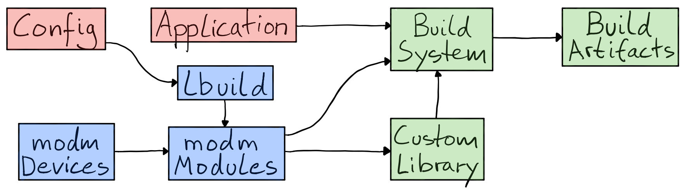
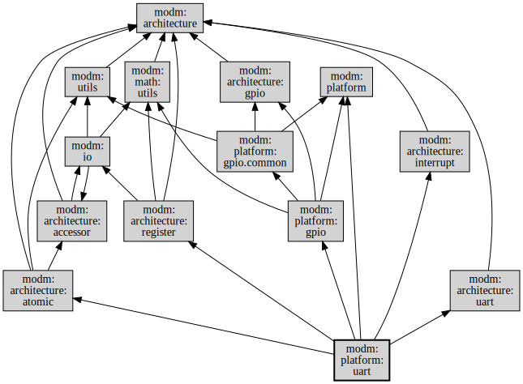

# How modm works

modm is an umbrella project for a handful of stand-alone projects and acts as
a curated toolbox for creating custom C++ libraries for embedded targets.
Three of these projects form the heart of modm:

- *[modm-devices][]* contains hardware descriptions like memories, peripherals and pins of many devices.
- *[modm][]* provides configurable modules to translate this data into code, tests and documentation.
- *[lbuild][]* links these two together using the Jinja2 template engine in Python to create a custom library for your target.

As a developer you can use lbuild to explore the modm modules, configure them
specifically for your targets and needs and generate a custom library.
You can generate more than just code, in this example, lbuild also generates a
build system which then compiles and links the application into a executable.

<style scoped>@media(prefers-color-scheme:dark){img{filter:invert(100%)}}</style>


We've also put a lot of thought into modm-devices, about what data to extract,
how to format and store it. We automated the entire process to get the high
quality data we use to build our library.
You can read all [about modm-devices in this blog post](http://blog.salkinium.com/modm-devices).


## modm is highly modular

modm's modules are kept small in scope on purpose and declare their dependencies,
so that lbuild can build a minimal library from the initial modules you specified.
So if you only want to use our UART drivers for example, lbuild will only include
code from that module and its dependencies.
This makes it easier to understand what parts of modm you actually use, either
by looking at the dependency graph before, or by inspecting the generated code
after calling lbuild, and gives you the opportunity to only use the parts of
modm you really like.



A lbuild module is just a few lines of Python code. Here we can see the code for
the `modm:platform:uart` module from the example above. It declares its name,
its dependencies and then which files it wants to generate where to using the
data from modm-devices, by just setting the `env.substitutions` to the device's
properties and calling `env.template` with the input and output file names.

```python
def init(module):
    module.name = ":platform:uart"
    module.description = "UART driver"

def prepare(module, options):
    module.depends(":architecture:interrupt", ":architecture:register",
                   ":architecture:atomic", ":architecture:uart", ":platform:gpio")
    return True

def build(env):
    device = env[":target"]
    env.substitutions = device.properties
    env.outbasepath = "src/modm/platform/uart"
    for instance in device.get_driver("uart:stm32*")["instance"]:
        env.template("uart.hpp.in", "uart_{}.hpp".format(instance))
        env.template("uart.cpp.in", "uart_{}.cpp".format(instance))
```

The input template then can access all the devices properties, and generate
the correct code for this device. Here the template on left is passed to the
[Jinja2 engine][jinja2] which outputs the code on the right.

<center>
<table class="" width="100%">
<tr>
<td>
```
void {{ name }}::write(uint8_t data)
{
%% if "extended" in driver["type"]
    {{ peripheral }}->TDR = data;
%% else
    {{ peripheral }}->DR = data;
%% endif
}
```
</td>
<td>
```cpp
void Uart4::write(uint8_t data)
{
    UART4->DR = data;
}
```
</td>
</tr>
</table>
</center>

This example is simple, but since it's based on Python, [anything more
complicated is possible](https://xkcd.com/353).
Looking at the data excerpt from a STM32 device the above module will generate a
only three classes of this type for this target. However, a similar driver will
generate classes for the four USART peripherals.

```xml
...
<driver name="uart" type="stm32">
  <instance value="4"/>
  <instance value="5"/>
  <instance value="7"/>
</driver>
<driver name="usart" type="stm32">
  <instance value="1"/>
  <instance value="2"/>
  <instance value="3"/>
  <instance value="6"/>
</driver>
...
```

With these techiques we can generate a target specific HAL for hundreds of devices.


## modm asserts at compile-time

modm stands out for its extensive use of generated static C++ (template) classes.
Consider this data from the GPIO peripheral, which shows the signal map for the
`PA0` pin on a STM32 device.

```xml
...
<driver name="gpio" type="stm32">
  <gpio port="a" pin="0">
    <signal driver="adc" instance="1" name="in0"/>
    <signal driver="adc" instance="2" name="in0"/>
    <signal driver="adc" instance="3" name="in0"/>
    <signal af="1" driver="tim" instance="2" name="ch1"/>
    <signal af="2" driver="tim" instance="5" name="ch1"/>
    <signal af="8" driver="uart" instance="4" name="tx"/>
    ...
```

We use this data in the `modm:platform:gpio` module to generate type-safe
signal connections, which will then assert that the signal you want to connect
actually exists on this pin and even gives you a helpful (!) error message at
compile time.

```cpp
class GpioA0
{
...
    template< Peripheral peripheral >
    struct Tx {
        static_assert(
            (peripheral == Peripheral::Uart4),
            "GpioA0::Tx only connects to Uart4!");
    };
    template< Peripheral peripheral >
    struct Ch1 {
        static_assert(
            (peripheral == Peripheral::Tim2) ||
            (peripheral == Peripheral::Tim5),
            "GpioA0::Ch1 only connects to Tim2 or Tim5!");
    };
    template< Peripheral peripheral >
    struct In0 {
        static_assert(
            (peripheral == Peripheral::Adc1) ||
            (peripheral == Peripheral::Adc2) ||
            (peripheral == Peripheral::Adc3),
            "GpioA0::In0 only connects to Adc1 or Adc2 or Adc3!");
    };
...
};
```

Continuing with this technique, we can even check if your signal groups are
conflict free of overlaps or invalid configurations and again give you a
helpful error message!

<center>
<table class="" width="100%">
<tr>
<td>
```cpp
Uart4::connect<GpioA0::Tx>();
Adc1::connect<GpioA0::In0, GpioA1::In1>();
Tim2::connect<GpioA0::Ch1, GpioA1::Ch2,
              GpioA2::Ch3, GpioA3::Ch4>();
Tim5::connect<GpioA0::Ch1, GpioA1::Ch2,
              GpioA2::Ch3, GpioA3::Ch4>();
```
</td>
<td>
```
Maps to GpioA0::setAlternateFunction(8);
Maps to GpioAx::setAnalogInput();
Each pin in group called with their
    respective Alternate Function ID
Same API, but for Timer5 different
    Alternate Function IDs are used
```
</td>
</tr>
<tr>
<td>
```cpp
Uart4::connect<GpioA0::Rx>();
```
</td>
<td>
```
error: 'Rx' is not a member of 'GpioA0'
```
</td>
</tr>
<tr>
<td>
```cpp
Uart4::connect<GpioA2::Tx>();
```
</td>
<td>
```
error: GpioA2::Tx only connects to Usart2!
```
</td>
</tr>
<tr>
<td>
```cpp
Usart1::connect<GpioA9::Tx, GpioB7::Rx>();
```
</td>
<td>
```
error: This pin set contains conflicting remap groups!
Available groups for Usart1 are:
 Usart1 | 0  | 1
--------|----|----
   A9   | Tx |
  A10   | Rx |
   B6   |    | Tx
   B7   |    | Rx
```
</td>
</tr>
</table>
</center>

We use a similar technique to [compute baudrates at compile time](http://blog.salkinium.com/computing-baudrates-at-compile-time)
and make sure the resulting baudrates remains within the specified error tolerances.
In addition the executable now only contains prescaler values which are written
directly to the hardware without any computation required. This is very helpful
for keeping code size in check on very resource constrained targets, like the AVRs.

```cpp
Uart4::connect<GpioA0::Tx, GpioA1::Rx>(Gpio::InputType::PullUp); // pull-up in RX pin
Uart4::initialize<Board::SystemClock, 115'200_Bd>(); // Within 1% default tolerance
Uart4::initialize<Board::SystemClock, 115.2_kBd, 0_pct>();
// error: The closest available baudrate exceeds the tolerance of the requested baudrate!
```


## modm is fast and usable

modm's APIs are kept simple and fast by splitting up functionality into
separate, small, static functions, which implement the same behavior on all
platforms.
And with our code generation capabilities, we can hide the crazy
implementation details of the hardware without compromising on performance.
For example, on different AVRs, simple things like enabling the internal pull-up resistor,
dealing with external interrupts or even just toggling a pin is done quite dissimilarly in hardware, yet we can wrap this in the same API for every target.

Since we‘re using static inlined functions that often just compile to a handful of instructions  we can call our GPIOs at [*ludicrous speed*][ludicrous].

```cpp
// All pin functions follow a common naming scheme
using Led = GpioB1;
Led::setOutput();
Led::set(); Led::reset();
Led::toggle();
using Button = GpioA0;
Button::setInput();
bool state = Button::read();

// Depending on your targets, additional functions are available
Led::setOutput(Gpio::OutputType::OpenDrain);
Button::setInput(Gpio::InputType::PullUp);
Button::setInputTrigger(Gpio::InputTrigger::RisingEdge);
Button::enableExternalInterrupt();
Button::acknowledgeExternalInterruptFlag();
```

You can use these GPIOs as building blocks for more complex drivers and
peripherals and still maintain access speed without sacrificing usability:

```cpp
// Create a hardware accelerated port of 4 bit width.
using Port4 = GpioPort< GpioC0, 4 >;        // MSB -> C3, C2, C1, C0 <- LSB
using ReadWrite = GpioC4;                   // "name" your GPIOs.
using Reset = GpioOutputC5;
using Enable = GpioOutputC6;

// Build a super fast character display driver using these inlined GPIOs.
modm::Hd44780<Port4, ReadWrite, Reset, Enable> display;
display.initialize();   // driver knows to initialize for a 4 bit bus!
display << "Hello World!" << modm::endl;    // Yes, ostreams. Deal with it.
display.printf("You don't really have to use %s!", "OStreams");
```

All drivers in modm follow the same principle of building up your hardware drivers from other parts of the HAL by passing them as template parameters. This works surprisingly well to reduce both code size and execution time. For example, here is how you assemble and initialize a driver for the MCP23x17 GPIO expander and then use its pins.

```cpp
using Transport = modm::Mcp23TransportSpi< SpiMaster1, GpioA0 >;
using GpioExpander = modm::Mcp23x17< Transport >;
GpioExpander expander;
// Connect and initialize the peripherals
SpiMaster1::connect<GpioA0::Sck, GpioA1::Mosi, GpioA2::Miso>();
SpiMaster1::initialize<Board::SystemClock, 1_MHz>();
expander.initialize();
// Bind the expander pins to a simpler name
using Pin0 = GpioExpander::P0< expander >;
using Pin1 = GpioExpander::P1< expander >;
// Oh, look, same API
Pin0::setOutput();
Pin0::toggle();
Pin1::setInput();
bool state = Pin1::read();
```

## modm is memory-efficient

Our HAL does not allocate memory dynamically – everything is either
statically allocated or must explicitly be allocated by the user.
This is a strong requirement for running modm on AVRs, which have
little if any memory to spare for dynamic allocations.

We took great care to make sure this constraint remains usable, making
configuration options first-class citizens in lbuild for you to easily discover
and safely change. When we do need to allocate static memory, we choose a
sensible default size for its purpose.

```
 $ lbuild discover-module-options
...
modm:platform:cortex-m:main_stack_size = 3040  [256 ... 65536]

  Minimum size of the application main stack
...
modm:platform:uart:1:buffer.rx = 16  [1 ... 65534]
modm:platform:uart:1:buffer.tx = 250  [1 ... 65534]
```

We transparently show you how much static memory your application is using,
so you get an idea of how much certain functionality costs you in resources.
This is the size of the accelerometer example on the STM32F4 discovery board:

```
 $ cd examples/stm32f4_discovery/accelerometer
 $ scons
...
Memory usage··· build/stm32f4_discovery/accelerometer/project.elf

Program:    8144B (0.8% used)
(.fastcode + .fastdata + .hardware_init + .reset + .rodata + .table.copy.intern +
 .table.section_heap + .table.zero.intern + .text)

Data:       3464B (1.7% used) = 424B static (0.2%) + 3040B stack (1.5%)
(.bss + .fastdata + .stack)

Heap:     197240B (98.3% available)
(.heap0 + .heap1 + .heap2 + .heap5)
```
<!-- (⚡️ automate size generation from example output) -->


## modm does multitasking

<!-- (⚡️ requires module documentation for protothread/resumable) -->

modm uses stackless cooperative multitasking, for which we have ported
protothreads to C++ and extended them with resumable functions.
This enables you to split up your application into separate tasks, and use
synchronous APIs in all of them, without sacrificing overall responsiveness.
This works on even the most resource restricted AVRs, since each task only
requires 2 bytes of static RAM!

All our IC drivers are implemented using resumable functions, which can be
called from within protothreads or explicitly blocking outside of them.
Here is an example of [reading out the accelerometer][accel]:

```cpp
class ReaderThread : public modm::pt::Protothread
{
public:
    bool run()
    {
        PT_BEGIN();
        // The driver does several I2C transfer here to initialize and configure the
        // external sensor. The CPU is free to do other things while this happens though.
        PT_CALL(accelerometer.configure(accelerometer.Scale::G2));

        while (true)    // this feels quite similar to regular threads
        {
            // this resumable function will defer execution back to other protothreads
            PT_CALL(accelerometer.readAcceleration());

            // smooth out the acceleration data a little bit
            averageX.update(accelerometer.getData().getX());
            averageY.update(accelerometer.getData().getY());

            // set the boards LEDs depending on the acceleration values
            LedUp::set(   averageX.getValue() < -0.2);
            LedDown::set( averageX.getValue() >  0.2);
            LedLeft::set( averageY.getValue() < -0.2);
            LedRight::set(averageY.getValue() >  0.2);

            // defer back to other protothreads until the timer fires
            PT_WAIT_UNTIL(timer.execute());
        }
        PT_END();
    }
private:
    // This accelerometer is connected via I2C.
    modm::Lis3dsh< modm::Lis3TransportI2c< I2cMaster > > accelerometer;
    modm::PeriodicTimer timer = modm::PeriodicTimer(5); // 5ms periodic timer.
    modm::filter::MovingAverage<float, 25> averageX;
    modm::filter::MovingAverage<float, 25> averageY;
};
ReaderThread reader;    // Protothread is statically allocated!

int main() // Execution entry point.
{
    while(true)
    {   // the main loop with implicit round robin cooperative scheduling.
        reader.run();
        otherProtothreads.run();
    }
    return 0;
}
```


[accel]: https://github.com/modm-io/modm/blob/develop/examples/stm32f4_discovery/accelerometer/main.cpp
[eurobot]: http://www.eurobot.org/
[hal_drivers]: https://github.com/modm-io/modm/tree/develop/src/modm/platform
[jinja2]: http://jinja.pocoo.org
[ludicrous]: https://www.youtube.com/watch?v=ygE01sOhzz0
[modm-devices]: https://github.com/modm-io/modm-devices
[modm]: https://github.com/modm-io/modm
[lbuild]: https://github.com/modm-io/lbuild
